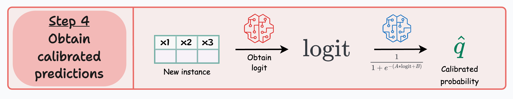
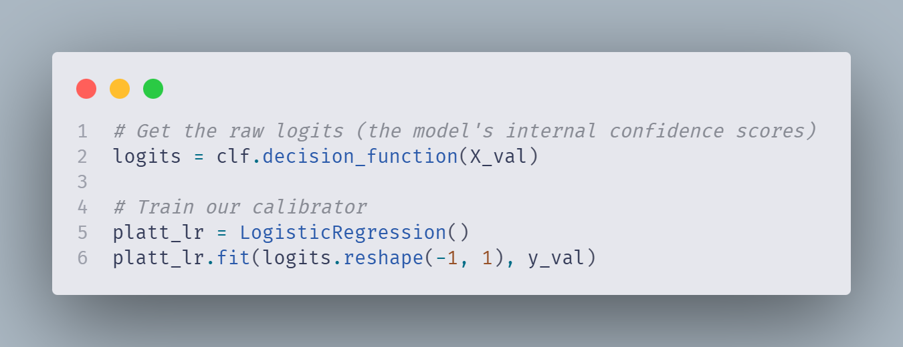
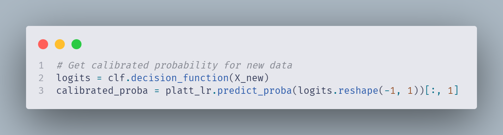

# Can You Trust Your Model? (Spoiler: Probably Not)

So you've built a classification model. You've tuned your hyperparameters like a DJ tweaking knobs at a club. Your accuracy score is *chef's kiss*. You're ready to deploy.

**But wait.** Have you ever asked yourself: *"Can I actually believe these predictions?"*

No, I'm not about to bore you with the "use Precision, Recall, F1 instead of Accuracy" sermon. You've heard that a million times. This is something different. Something that will make you look at your classification models and whisper: *"I trusted you..."*

---

## The Overconfident Model Problem

Let me paint you a picture.

Imagine a weather app that predicts the chance of rain every day. One morning, it smugly declares:

> *"There's a 60% chance of rain today."*

Now, if you collect 100 days where the app predicted 60% rain, and it actually rained on about 60 of those days — congratulations! Your model is **well-calibrated**.

The predicted probability matches real-world outcomes. What a concept.

**But here's where things get spicy.**

Take a look at this comparison between a LeNet (developed in 1998) and a ResNet (developed in 2016) on the CIFAR-100 dataset:

| Model  | Accuracy | Average Confidence |
| ------ | -------- | ------------------ |
| LeNet  | ~0.55    | ~0.54              |
| ResNet | ~0.70    | ~0.90              |

See the problem?

LeNet is like that humble friend who says, "I think I got 55% on the test" and actually gets 54%. Honest. Reliable. A bit boring, but trustworthy.

ResNet is like that overconfident classmate who struts out of the exam saying, "Absolutely nailed it, at least 90%" — and then gets 70%.

**The ResNet is a liar.** A very accurate liar, but still a liar.

When your model thinks it's 90% confident but is only 70% accurate, you have a **calibration problem**. And if you're making decisions based on those probabilities (healthcare, finance, literally anything important), you're in trouble.

---

## Why Should You Care?

Let me give you a real-world scenario that'll keep you up at night.

> *A government hospital wants to conduct an expensive medical test on patients. Since the test is costly, doctors want to use a model to prioritize patients.*

If the model predicts a **75% probability** that a patient has the disease, ideally, out of 100 such patients, around 75 should actually have it.

But if your model is overconfident like our friend ResNet? You might be wasting resources on patients who don't need the test, while missing those who do.

**Calibration isn't just a nice-to-have. It's the difference between a useful model and an expensive mistake.**

---

## Enter: Platt Scaling (The Hero We Needed)

Alright, enough doom and gloom. Let's fix this.

**Platt Scaling** is beautifully simple. It's basically teaching a second model to translate your first model's overconfident gibberish into honest probabilities.

Here's the recipe:

1. **Train your base model** on the training data (it'll probably be overconfident, the audacity)
2. **Get the logits** (raw scores before sigmoid) on your validation data
3. **Train a Logistic Regression** that maps those logits to actual outcomes
4. **Use this calibrator** to transform future predictions into honest probabilities

Simple, right? Let's see it in action.

---

## Let's Get Our Hands Dirty

Time to stop philosophizing and start coding. We'll use a loan prediction dataset to demonstrate.

After the usual data science janitorial work (loading data, imputing missing values, scaling, encoding — you know the drill), we train our base model:

---

## The Magic: Platt Scaling

Here's where the calibration happens. We grab the logits from our base model and train a Logistic Regression to map them to calibrated probabilities.

That's it. Three lines. We just taught our model some humility.

Now to get calibrated predictions, just pass new data through both models:

> **Pro tip:** Use **Brier score** and **Log loss** to measure calibration quality. Lower = better. These metrics punish overconfidence.

---

## Visualizing the Calibration

A picture is worth a thousand probability estimates. Use `sklearn.calibration.calibration_curve` to plot your results:

The **dashed diagonal line** is the dream — perfect calibration. Notice how the Platt-scaled model hugs that line much more closely? That's what honesty looks like.

---

## The Catch (There's Always a Catch)

Before you go Platt-scaling everything in sight, a word of caution:

> ⚠️ **Platt Scaling is sensitive to calibration set size.**
>
> When your calibration dataset is small, Platt scaling can produce unreliable estimates. It's like trying to learn someone's personality from a single conversation — you're going to get it wrong.

For small datasets, consider alternatives like **Isotonic Regression** or **Temperature Scaling**.

---

## TL;DR (For The Scroll-Happy)

1. **Most models are overconfident.** They say 90% when they mean 70%.
2. **This matters** when you're making decisions based on probabilities.
3. **Platt Scaling** is a simple fix: train a Logistic Regression on your model's logits.
4. **It works** — but needs enough calibration data to be reliable.
5. **Always plot your calibration curves.** Trust, but verify.

---

## Final Thoughts

The next time your model confidently predicts something, remember: confidence isn't competence. A well-calibrated model might be less flashy, but at least it won't gaslight you.

So go forth, calibrate your models, and never let an overconfident neural network hurt you again.

---

*Found this useful? Share it with someone whose model is probably lying to them right now.*

*And if you learned something new today, drop a comment below — I need validation almost as much as your uncalibrated model does.*

---

**Further Reading:**

- [Original Platt Scaling Paper](https://www.cs.colorado.edu/~mozer/Teaching/syllabi/6622/papers/Platt1999.pdf)
- [Sklearn Calibration Guide](https://scikit-learn.org/stable/modules/calibration.html)
- [Full Implementation Notebook](https://colab.research.google.com/drive/12W6renaOc2vHNb0Oi-h3-FQpbhI-9KAo?usp=sharing)
